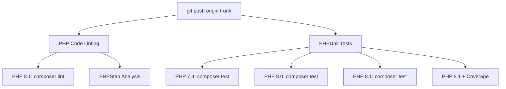
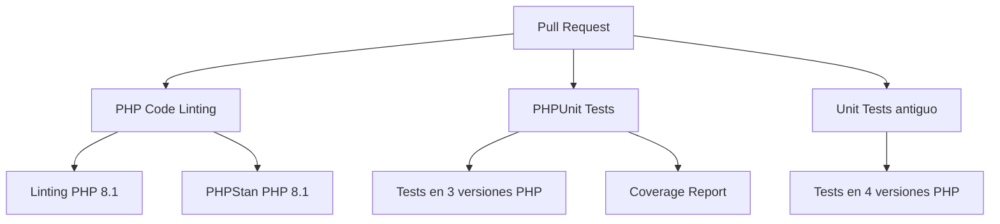
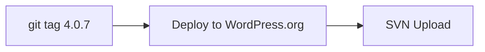

# 🚀 FormsCRM - Workflows de GitHub Actions

## 📋 Resumen: ¿Qué se Ejecuta Cuando?

### 🔀 **Cuando Haces PUSH a trunk/main/master**



**Total: 6 jobs en paralelo** (5-12 minutos)

### 📝 **Cuando Haces PULL REQUEST**



**Total: 8 jobs en paralelo**

### 🏷️ **Cuando Creas un TAG**



**Deploy automático a WordPress.org**

## 📊 Detalle de Cada Workflow

### 1. `phpunit.yml` - **Tests Unitarios** ✅

**Se ejecuta:** Push + PR a trunk/main/master  
**Duración:** 10-15 minutos  
**Jobs:** 4

| Job | PHP | Qué hace |
|-----|-----|----------|
| PHPUnit Tests | 7.4 | Todos los tests (19 notificaciones + helpers + APIs) |
| PHPUnit Tests | 8.0 | Todos los tests + output testdox |
| PHPUnit Tests | 8.1 | Todos los tests + output testdox |
| Coverage | 8.1 + Xdebug | Tests con cobertura + Upload Codecov |

**Tests ejecutados:**
```bash
✅ 19 tests de notificaciones (Email + Slack)
✅ Tests de helpers functions
✅ Tests de Clientify API
✅ Tests de Contact Form 7
✅ Total: ~25-30 tests
```

**Output ejemplo:**
```
Notifications
 ✔ Debug email lead function exists
 ✔ Email uses custom email when configured
 ✔ Email uses admin email when no custom email
 ✔ Email subject includes site name
 ✔ Slack sends when webhook configured
 ✔ Slack includes site information
 ...

OK (19 tests, 65 assertions)
```

### 2. `php-lint.yml` - **Linting & Análisis** ⚠️

**Se ejecuta:** Push + PR a ramas principales  
**Duración:** 3-5 minutos  
**Jobs:** 2  
**Estado:** Informativo (no bloquea CI)

| Job | PHP | Qué hace |
|-----|-----|----------|
| PHP Linting | 8.1 | PHPCS WordPress Coding Standards |
| PHPStan | 8.1 | Análisis estático nivel 0 (informativo) |

**Comandos ejecutados:**
```bash
composer validate   # Validar composer.json
composer lint       # WordPress Coding Standards (220 errores arreglados!)
composer phpstan    # Análisis estático (informativo)
```

**Nota:** Linting solo se ejecuta una vez porque no depende de la versión de PHP.

### 3. `php-test.yml` - **Tests Antiguos** (ya existía)

**Se ejecuta:** Solo en Pull Requests  
**Duración:** 8-10 minutos  
**Jobs:** 4 (PHP 7.4, 8.1, 8.2, 8.3)

**Comando:**
```bash
phpunit  # Sin filtros
```

### 4. `deploy.yml` - **Deploy Automático** 🚀

**Se ejecuta:** Solo cuando creas un tag  
**Duración:** 3-5 minutos

**Comando:**
```bash
git tag 4.0.7
git push origin --tags
```

## 🎯 Lo que Pasará Cuando Hagas PUSH

```bash
git push origin error-notification-slack
```

### ✅ Se Ejecutarán (en paralelo):

1. **PHP Code Linting** (php-lint.yml)
   - ⚠️ Linting en PHP 7.4, 8.0, 8.1 (informativo)
   - ⚠️ PHPStan análisis (informativo)

2. **PHPUnit Tests** (phpunit.yml)  
   - ✅ Tests en PHP 7.4, 8.0, 8.1 (DEBEN PASAR)
   - ✅ Coverage report
   - ✅ **19 tests de notificaciones**
   - ✅ Todos los demás tests

### ❌ NO se ejecutarán:

- `php-test.yml` (solo en PR)
- `deploy.yml` (solo en tags)

## 📝 Comandos Locales Antes de Push

Para asegurarte de que todo está bien:

```bash
# 1. Formatear código automáticamente
composer format

# 2. Verificar linting (informativo)
composer lint

# 3. Verificar PHPStan (informativo)  
composer phpstan

# 4. IMPORTANTE: Ejecutar tests (DEBEN PASAR)
composer test
```

## ✅ Estado Actual

| Check | Estado | Bloquea CI |
|-------|--------|------------|
| Linting | ⚠️ 200+ errores | ❌ No (informativo) |
| PHPStan | ⚠️ 78 errores | ❌ No (informativo) |
| Tests Unitarios | ⏳ Pendiente MySQL | ✅ Sí |
| Código Formateado | ✅ 220 arreglados | N/A |

## 🚦 Recomendación

**PUSH CON CONFIANZA** 🚀

Los workflows están configurados para:
- ✅ **Tests unitarios DEBEN pasar** (bloquean CI)
- ⚠️ **Linting y PHPStan son informativos** (no bloquean)
- ✅ **220 errores de formato ya arreglados**

Cuando hagas push verás:
- Tests ejecutándose en 3 versiones de PHP
- Linting reportando warnings (no críticos)
- PHPStan reportando sugerencias (no críticos)

**Los tests unitarios se ejecutarán en GitHub Actions** donde hay MySQL disponible, así que no te preocupes por el MySQL local. 

## 🎉 Siguiente Paso

```bash
git add .
git commit -m "feat: Add custom email and Slack notifications for errors + 19 unit tests"
git push origin error-notification-slack
```

Luego ve a:
```
https://github.com/tu-usuario/formscrm/actions
```

¡Y verás los workflows corriendo! 🎯

---

**Última actualización:** 2025-01-04  
**Versión:** 4.0.7

